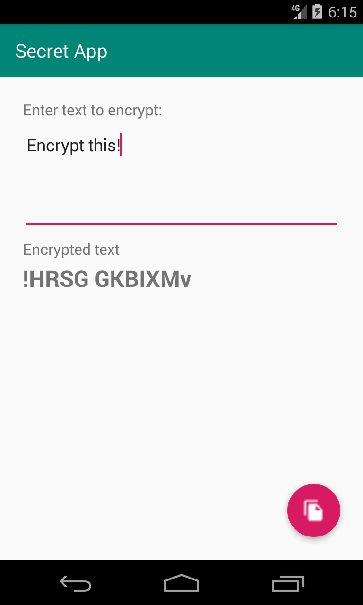

# Download the latest version

You can download the app from the [Google Play Store](https://play.google.com/store/apps/details?id=com.aspenshore.secretapp)

A built version of the Secret App is available in APK format on Github:

[Download here](https://github.com/dogriffiths/SecretApp/releases/tag/published-40)

# Source code

The source code for this app is available on [Github](https://github.com/dogriffiths/SecretApp)

